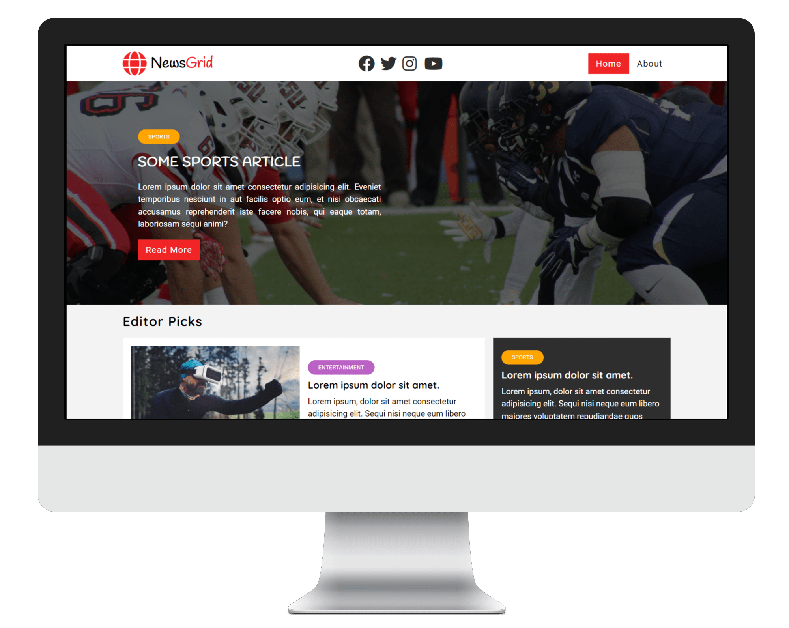

# News-website

Este projeto é de um **site de notícias** anônimo. Ele é criado com HTML, CSS e um pouco de JS. JS é apenas para a parte do pré-carregador. Tive essa ideia de projeto, porque eu precisava treinar um pouco mais Css, e o layout desse site é projetado com a combinação de css-flex e css-grid. Eu simplesmente amei o resultado, demorou um pouco para terminar, pois fiz um desing "beta" desse site, pelo [Figma](https://www.figma.com/), só que na hora do desenvolvimento, tive novas ideias e fui adicionando. Segue o link abaixo de como ficou, Ao vivo!

## Live site:

Clique [neste link azul](https://cauathiago.github.io/projeto-news-website/index.html), para poder ter acesso ao site rodando ao vivo.

## screen:

## Olá??

Se você gostou desse projeto, ou tem novas ideias para ele, me chame nas redes sociais abaixo:

 
 

 